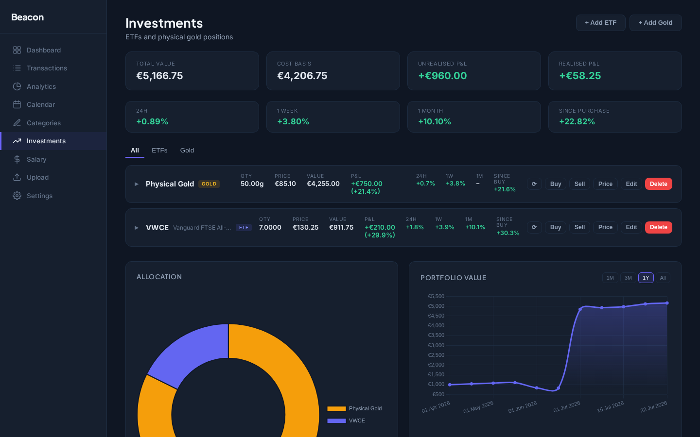
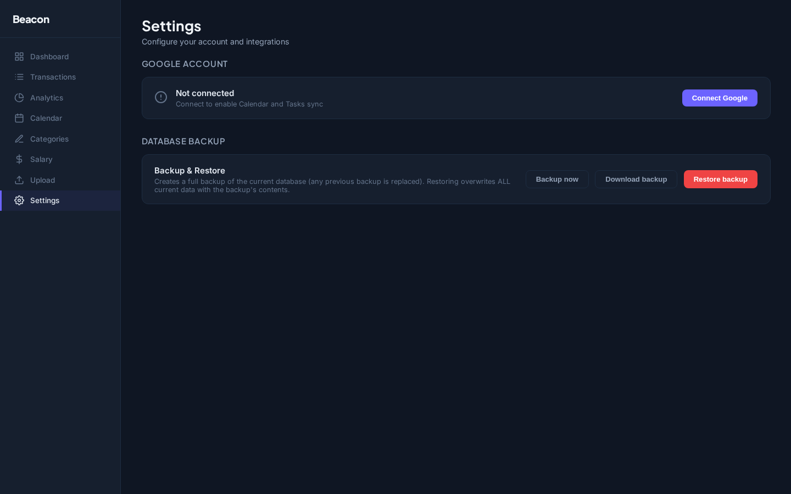

# Beacon

A self-hosted personal finance dashboard. Upload bank statement PDFs and salary slips, and the app extracts transactions, categorises them automatically, and gives you analytics over time. Built to run on a home server and accessed remotely.

---

## Screenshots

### Dashboard


### Transactions


### Analytics


### Rules


### Salary


### Upload


### Investments



### Settings



---

## What it does

Bank statement PDFs are uploaded through the web interface. A Python script (pdfplumber) extracts the raw text per page, and a bank-specific parser turns that into structured transaction records. From there you can set categories on transactions manually or create rules that apply categories automatically based on description patterns. The analytics page aggregates spending by category and month.

Salary slip PDFs go through a similar flow - upload, parse, review the extracted numbers, then save. Salary profiles let you track multiple jobs or income sources separately.

Grocery receipts from Continente can be uploaded as PDFs. Items are extracted, mapped to spending categories, and displayed in a filterable item list with monthly totals.

Meal-card statements (which have no PDF export) are imported by pasting the transaction history as text.

The Investments page tracks ETF and physical gold positions: buy/sell lots with fees, average-cost P&L (realised and unrealised), price change over 24h/1 week/1 month/since purchase, an allocation chart and portfolio value history. Prices come from Alpha Vantage (free tier): automatic refresh during market hours plus a one-call backfill of daily price history back to your first purchase. Gold is tracked in grams; ETFs are assumed EUR-listed.

Beyond finance, the app integrates with Google Calendar and Google Tasks (optional): the Calendar page shows your events and tasks, supports creating/editing both, and works fully offline from Google with a graceful empty state. The Settings page manages the Google connection and database backup/restore, including downloading the backup file.

Everything is stored in SQL Server and served over a REST API. The Angular frontend talks to the API through a proxy in development, and through Nginx in production.

---

## Supported formats

| Type | Format | Detection |
| --- | --- | --- |
| Bank statement (PDF) | ActivoBank | BIC `ACTVPTPL` or "EXTRATO COMBINADO" |
| Bank statement (PDF) | BPI | SWIFT `BBPIPTPL` or "EXTRACTO INTEGRADO" |
| Bank statement (PDF) | Revolut (EUR accounts) | BIC `REVOPTP2` or "Revolut Bank UAB" |
| Salary slip (PDF) | CentralGest payroll | "CentralGest Software" footer |
| Salary slip (PDF) | Domirest payroll | "DOMIREST" header |
| Grocery receipt (PDF) | Continente | "Modelo Continente" |
| Meal card | Pasted text (one transaction per line) | - |

Bank statements must be EUR - non-EUR statements are rejected at upload (salary slips and grocery receipts are not currency-checked). Scanned (image-only) PDFs are rejected with a clear message. Files that match none of the formats are reported per file without failing the batch.

---

## Tech stack

| Layer          | Technology                                     |
| -------------- | ---------------------------------------------- |
| PDF extraction | Python 3 + pdfplumber                          |
| API            | ASP.NET Core 8 (.NET 8)                        |
| Database       | SQL Server + EF Core 8 (code-first migrations) |
| Frontend       | Angular 21 (standalone components, signals)    |
| Charts         | Chart.js 4                                     |
| Tests          | xUnit (backend), Vitest (frontend)             |

---

## Architecture

The backend follows a feature-driven CQRS pattern without MediatR - each use case is a plain class injected via DI. There's no handler registry or reflection magic; everything is registered explicitly in `Program.cs`. Features live under `api/Beacon.Api/Features/`, each with `Commands/` and `Queries/` subdirectories.

```
Features/
  Transactions/
    Commands/SetTransactionCategory/
      SetTransactionCategoryCommand.cs
      SetTransactionCategoryCommandHandler.cs
      SetTransactionCategoryResponse.cs
    Queries/GetTransactions/
  Categories/
  Salary/
  Statements/
```

PDF parsers use a strategy pattern. Every parser implements `IBankStatementParser`, `ISalarySlipParser` or `IGroceryReceiptParser`, and a factory picks the right one at runtime by calling `CanParse()` against the extracted text. Adding a new bank means adding one file and one DI registration - nothing else changes. Meal-card text goes through the static `MealCardTextParser`, and every parsed document passes a `ParseVerifier` reconciliation (opening + credits − debits vs closing, line items vs totals) that surfaces warnings in the UI.

The frontend uses Angular signals for state. `FinanceService` is the single source of truth and exposes computed signals that derived components consume directly. There are no NgModules; everything is standalone components with lazy-loaded routes.

---

## Project structure

```
beacon/
├── api/
│   ├── Beacon.Api/
│   │   ├── Controllers/
│   │   ├── Data/              # AppDbContext (EF Core)
│   │   ├── Features/          # CQRS handlers per feature
│   │   ├── Migrations/        # EF Core generated
│   │   ├── Models/            # Domain entities
│   │   └── Services/Parsing/  # Bank & salary PDF parsers
│   └── Beacon.Tests/      # xUnit tests
├── web/
│   └── src/app/
│       ├── core/              # Services, interceptors, models, utils
│       └── pages/             # Lazy-loaded routed components
├── scripts/
│   ├── pdfExtractor.py        # Python: PDF → page text (called by .NET)
│   ├── deploy.sh              # Build and launch dev/prod in new terminals
│   └── reset-db.sh / .ps1     # Drop + recreate database
└── beacon.sln
```

---

## Getting started

### Requirements

- .NET 8 SDK (plus the EF tool: `dotnet tool install --global dotnet-ef`)
- Node.js 22 (via nvm recommended)
- SQL Server (local, or via Docker:
  `docker run -e ACCEPT_EULA=Y -e MSSQL_SA_PASSWORD='<yourStrong!Password>' -p 1433:1433 -d mcr.microsoft.com/mssql/server:2022-latest`)
- Python 3 + pdfplumber: `pip install -r scripts/requirements.txt`
  (on Debian/Ubuntu with PEP 668 protection, use a venv or `pip install --user --break-system-packages -r scripts/requirements.txt`)

### Configuration

Copy `api/Beacon.Api/appsettings.template.json` to `appsettings.Development.json` and fill in:

- `ApiKey` - **must be `dev-only-key` for local development**: the Angular dev build sends that exact value (`web/src/environments/environment.ts`) in the `X-Api-Key` header, so a different backend key makes every frontend call fail with 401. Note that if you leave `ApiKey` unset entirely, Development mode skips key validation altogether - set it anyway so dev behaves like production (which fails closed). Pick your own secret only for production, where `deploy.sh` injects it into the frontend build.
- `ConnectionStrings.DefaultConnection` - SQL Server connection string
- `Storage.Path` - where uploaded PDFs will be stored
- `Python.Executable` - `python3` on Linux/macOS, `python` on Windows (the stock `python3` alias on Windows opens the Microsoft Store instead of running Python)
- `Python.ExtractorScript` - absolute path to `scripts/pdfExtractor.py`

The committed `api/Beacon.Api/Properties/launchSettings.json` sets `ASPNETCORE_ENVIRONMENT=Development` and port `5098`, so `dotnet run` picks up `appsettings.Development.json` and matches the frontend proxy with no extra flags.

### Create the database (first run only)

```bash
cd api/Beacon.Api
dotnet ef database update
```

### Linux / macOS

```bash
# Terminal 1 - API (http://localhost:5098)
cd api/Beacon.Api
export ApiKey=dev-only-key
dotnet run

# Terminal 2 - Frontend (http://localhost:4200)
cd web
npm install
npx ng serve
```

Swagger UI: `http://localhost:5098/swagger` (no API key needed in development).

### Windows

```powershell
# Terminal 1 - API
cd api\Beacon.Api
$env:ApiKey="dev-only-key"
dotnet run

# Terminal 2 - Frontend
cd web
npm install
npx ng serve
```

The Angular dev server proxies `/api/*` to `http://localhost:5098` via `web/proxy.conf.json`.

---

## Environment variables

| Variable                               | Description                                                                                   |
| -------------------------------------- | --------------------------------------------------------------------------------------------- |
| `ApiKey`                               | Secret validated via `X-Api-Key` header                                                       |
| `Storage__Path`                        | Directory for uploaded PDFs                                                                   |
| `Backup__Path`                         | Directory for database backups                                                                |
| `ConnectionStrings__DefaultConnection` | SQL Server connection string                                                                  |
| `Python__Executable`                   | Python binary (`python` or `python3`)                                                         |
| `Python__ExtractorScript`              | Absolute path to `scripts/pdfExtractor.py`                                                    |
| `AlphaVantage__ApiKey`                 | Alpha Vantage API key (optional - only needed for investment price fetching)                  |
| `AlphaVantage__DailyQuota`             | Alpha Vantage daily request quota (default 25)                                                |
| `AlphaVantage__ReservedForManual`      | Quota reserved for manual fetches and backfills (default 5)                                   |
| `GoogleServices__ClientId`             | Google OAuth 2.0 client ID (optional - only needed for Google Calendar/Tasks sync)            |
| `GoogleServices__ClientSecret`         | Google OAuth 2.0 client secret                                                                |
| `GoogleServices__RedirectUri`          | OAuth redirect URI registered in Google Cloud Console                                         |
| `GoogleServices__FrontendUrl`          | Base URL of the Angular frontend, used to redirect after OAuth (e.g. `http://localhost:4200`) |

---

## Database

```bash
cd api/Beacon.Api
dotnet ef migrations add <MigrationName>
dotnet ef database update
```

To reset to a clean state: `./scripts/reset-db.sh` (Linux) or `./scripts/reset-db.ps1` (Windows).

---

## Tests

```bash
# Backend - xUnit (481 tests)
cd api
dotnet test Beacon.Tests/

# Frontend - Vitest
cd web
npx ng test --watch=false
```

Backend coverage spans all bank/salary/grocery parsers, the upload pipeline (behind a stubbed PDF extractor), the API-key and exception middleware, categorisation rules, backup/restore (including an optional SQL Server-backed round-trip test, enabled by setting `BEACON_TEST_SQLSERVER` to a connection string), and the CQRS handlers for statements, transactions, categories, salary, groceries, investments (including Alpha Vantage request pinning and price-history backfill) and Google services.

---

## Deployment

`scripts/deploy.sh --production` is headless-safe (works over plain SSH). It builds the API and the Angular bundle **before touching the live service**, injects the production API key into the *built* frontend files (tracked sources are never modified), applies EF migrations, snapshots the current release to `/opt/beacon.prev`, deploys to `/opt/beacon`, and restarts the `beacon` systemd service and Nginx - verifying the API actually answers before declaring success. Every step fails loudly (`set -euo pipefail`); a failed build leaves production untouched.

```bash
./scripts/deploy.sh --production   # deploy
./scripts/deploy.sh --rollback     # restore the previous release (migrations are NOT reverted)
journalctl -u beacon -f            # production logs (journald)
```

Server prerequisites: a `beacon` systemd unit at `/etc/systemd/system/beacon.service`, Nginx, and a filled-in `local/environment` file (loaded via the unit's `EnvironmentFile`).

Development mode (`./scripts/deploy.sh`) opens API and Web dev servers in two tiled gnome-terminal windows - a desktop convenience, not used in production.

The app is designed to run on a home server and be accessed remotely over Tailscale. Nginx acts as a reverse proxy, serving the Angular build as static files and forwarding `/api/*` to Kestrel.

---

## Security model

A single shared API key (`X-Api-Key` header) protects every endpoint - there are no user accounts. The key is embedded in the built frontend, so anyone who can load the app can call the API: the intended deployment is a private network (e.g. Tailscale) where reachability *is* the trust boundary. Do not expose the app directly to the internet.

---

## License

MIT - see [LICENSE](LICENSE).
