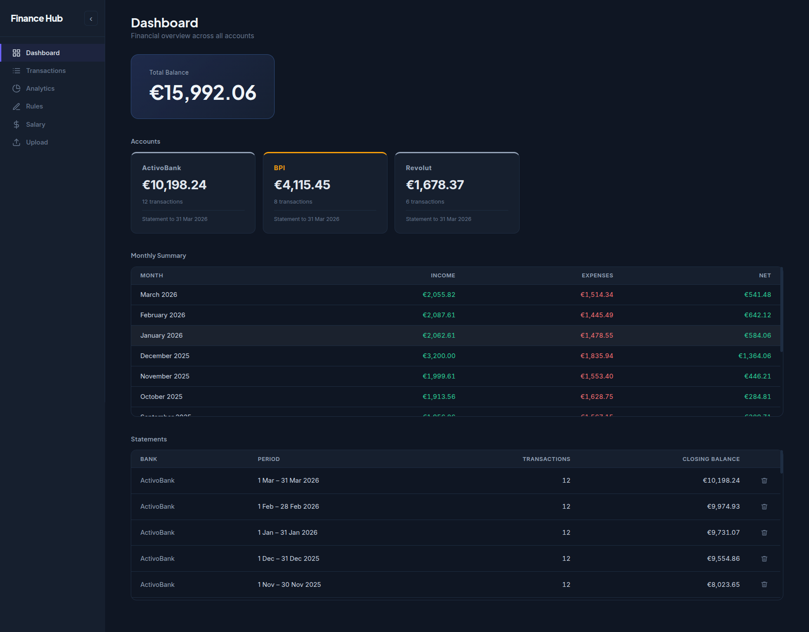
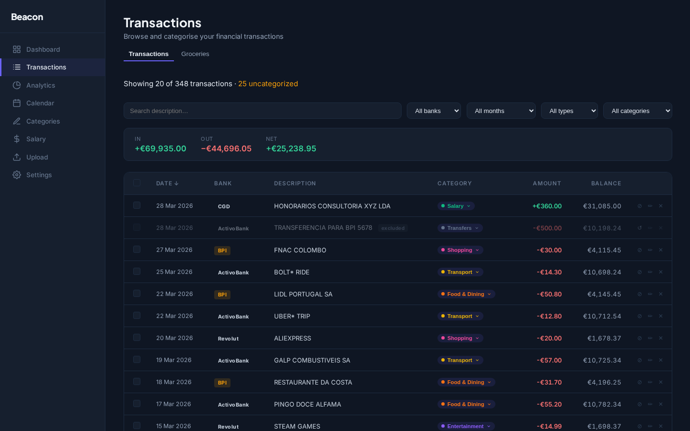
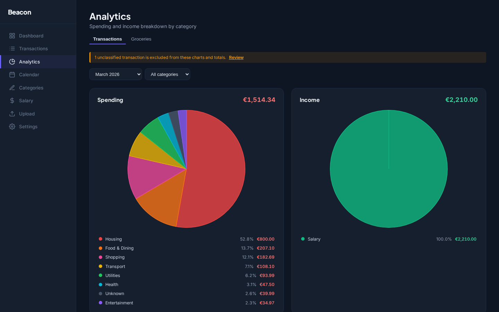
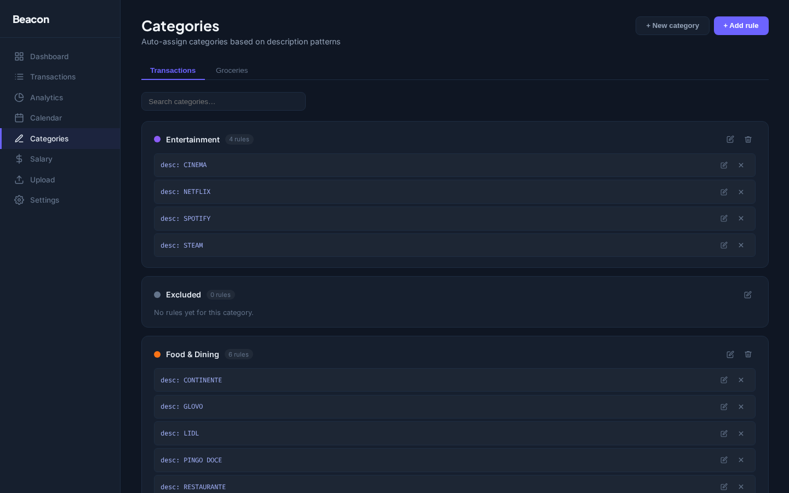
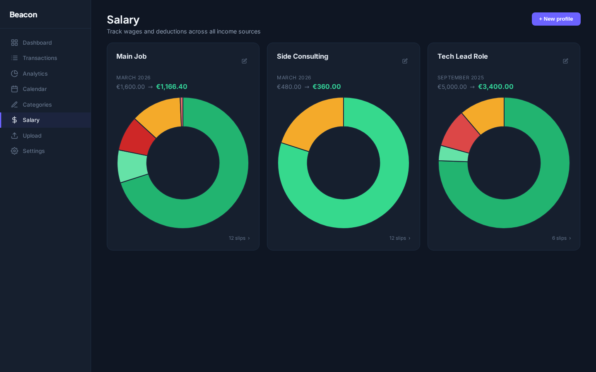
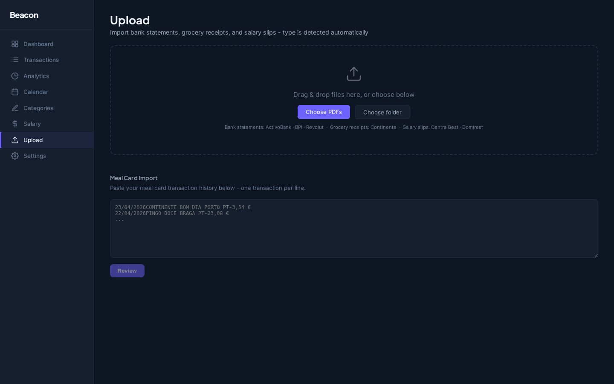

# Beacon

A self-hosted personal finance dashboard. Upload bank statement PDFs and salary slips, and the app extracts transactions, categorises them automatically, and gives you analytics over time. Built to run on a home server and accessed remotely.

---

## Screenshots

### Dashboard



### Transactions



### Analytics



### Rules



### Salary



### Upload



---

## What it does

Bank statement PDFs are uploaded through the web interface. A Python script (pdfplumber) extracts the raw text per page, and a bank-specific parser turns that into structured transaction records. From there you can set categories on transactions manually or create rules that apply categories automatically based on description patterns. The analytics page aggregates spending by category and month.

Salary slip PDFs go through a similar flow — upload, parse, review the extracted numbers, then save. Salary profiles let you track multiple jobs or income sources separately.

Grocery receipts from Continente can be uploaded as PDFs. Items are extracted, mapped to spending categories, and displayed in a filterable item list with monthly totals.

Everything is stored in SQL Server and served over a REST API. The Angular frontend talks to the API through a proxy in development, and through Nginx in production.

---

## Tech stack

| Layer          | Technology                                     |
| -------------- | ---------------------------------------------- |
| PDF extraction | Python 3 + pdfplumber                          |
| API            | ASP.NET Core 8 (.NET 8)                        |
| Database       | SQL Server + EF Core 8 (code-first migrations) |
| Frontend       | Angular 21 (standalone components, signals)    |
| Charts         | Chart.js 4                                     |
| Tests          | xUnit (backend), Vitest (frontend)             |

---

## Architecture

The backend follows a feature-driven CQRS pattern without MediatR — each use case is a plain class injected via DI. There's no handler registry or reflection magic; everything is registered explicitly in `Program.cs`. Features live under `api/Beacon.Api/Features/`, each with `Commands/` and `Queries/` subdirectories.

```
Features/
  Transactions/
    Commands/SetTransactionCategory/
      SetTransactionCategoryCommand.cs
      SetTransactionCategoryCommandHandler.cs
      SetTransactionCategoryResponse.cs
    Queries/GetTransactions/
  Categories/
  Salary/
  Statements/
```

PDF parsers use a strategy pattern. Every parser implements `IBankStatementParser` (or `ISalarySlipParser`), and a factory picks the right one at runtime by calling `CanParse()` against the extracted text. Adding a new bank means adding one file and one DI registration — nothing else changes.

The frontend uses Angular signals for state. `FinanceService` is the single source of truth and exposes computed signals that derived components consume directly. There are no NgModules; everything is standalone components with lazy-loaded routes.

---

## Project structure

```
beacon/
├── api/
│   ├── Beacon.Api/
│   │   ├── Controllers/
│   │   ├── Data/              # AppDbContext (EF Core)
│   │   ├── Features/          # CQRS handlers per feature
│   │   ├── Migrations/        # EF Core generated
│   │   ├── Models/            # Domain entities
│   │   └── Services/Parsing/  # Bank & salary PDF parsers
│   └── Beacon.Tests/      # xUnit tests
├── web/
│   └── src/app/
│       ├── core/              # Services, interceptors, models, utils
│       └── pages/             # Lazy-loaded routed components
├── scripts/
│   ├── pdfExtractor.py        # Python: PDF → page text (called by .NET)
│   ├── deploy.sh              # Build and launch dev/prod in new terminals
│   └── reset-db.sh / .ps1     # Drop + recreate database
└── beacon.sln
```

---

## Getting started

### Requirements

- .NET 8 SDK
- Node.js 22 (via nvm recommended)
- SQL Server (local or Docker)
- Python 3 + pdfplumber (`pip install pdfplumber`)

### Configuration

Copy `api/Beacon.Api/appsettings.template.json` to `appsettings.Development.json` and fill in:

- `ApiKey` — any string, used as the `X-Api-Key` header
- `ConnectionStrings.DefaultConnection` — SQL Server connection string
- `Storage.Path` — where uploaded PDFs will be stored
- `Python.ExtractorScript` — absolute path to `scripts/pdfExtractor.py`

### Linux / macOS

```bash
# Terminal 1 — API (http://localhost:5098)
cd api/Beacon.Api
export ApiKey=dev-only-key
dotnet run

# Terminal 2 — Frontend (http://localhost:4200)
cd web
npm install
npx ng serve
```

Swagger UI: `http://localhost:5098/swagger` (no API key needed in development).

### Windows

```powershell
# Terminal 1 — API
cd api\Beacon.Api
$env:ApiKey="dev-only-key"
dotnet run

# Terminal 2 — Frontend
cd web
npm install
npx ng serve
```

The Angular dev server proxies `/api/*` to `http://localhost:5098` via `web/proxy.conf.json`.

---

## Environment variables

| Variable                               | Description                                                                                   |
| -------------------------------------- | --------------------------------------------------------------------------------------------- |
| `ApiKey`                               | Secret validated via `X-Api-Key` header                                                       |
| `Storage__Path`                        | Directory for uploaded PDFs                                                                   |
| `Backup__Path`                         | Directory for database backups                                                                |
| `ConnectionStrings__DefaultConnection` | SQL Server connection string                                                                  |
| `Python__Executable`                   | Python binary (`python` or `python3`)                                                         |
| `Python__ExtractorScript`              | Absolute path to `scripts/pdfExtractor.py`                                                    |
| `GoogleServices__ClientId`             | Google OAuth 2.0 client ID (optional — only needed for Google Calendar/Tasks sync)            |
| `GoogleServices__ClientSecret`         | Google OAuth 2.0 client secret                                                                |
| `GoogleServices__RedirectUri`          | OAuth redirect URI registered in Google Cloud Console                                         |
| `GoogleServices__FrontendUrl`          | Base URL of the Angular frontend, used to redirect after OAuth (e.g. `http://localhost:4200`) |

---

## Database

```bash
cd api/Beacon.Api
dotnet ef migrations add <MigrationName>
dotnet ef database update
```

To reset to a clean state: `./scripts/reset-db.sh` (Linux) or `./scripts/reset-db.ps1` (Windows).

---

## Tests

```bash
# Backend — xUnit (355 tests)
cd api
dotnet test Beacon.Tests/

# Frontend — Vitest
cd web
npm test -- --run
```

Backend test coverage includes all bank and salary slip parsers, the API key middleware, categorisation rule service, CQRS handlers for transactions and categories and Google Services

---

## Deployment

`scripts/deploy.sh` builds both the API and frontend, applies pending migrations, and launches everything. In production mode it copies the build output to `/opt/beacon`, reloads the systemd service, and starts Nginx.

```bash
./scripts/deploy.sh --production
```

The app is designed to run on a home server and be accessed remotely over Tailscale. Nginx acts as a reverse proxy, serving the Angular build as static files and forwarding `/api/*` to Kestrel.

---

## License

MIT — see [LICENSE](LICENSE).
