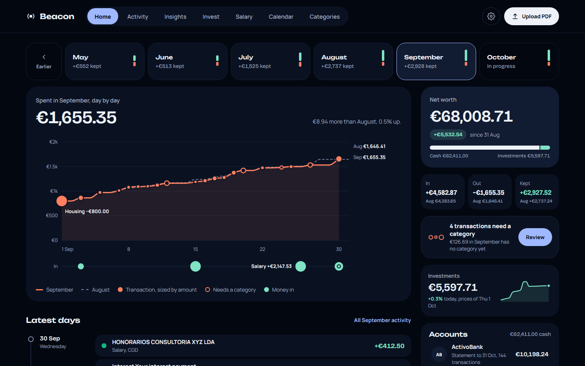
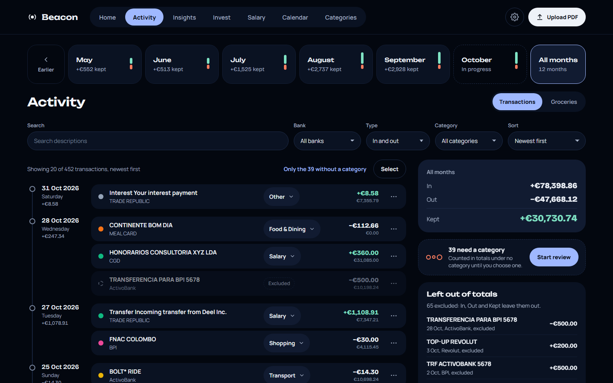
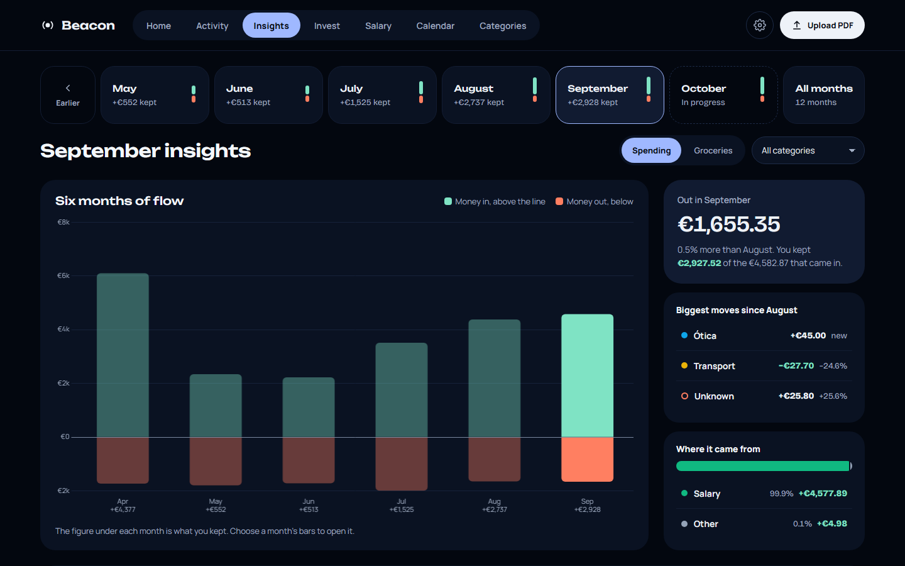
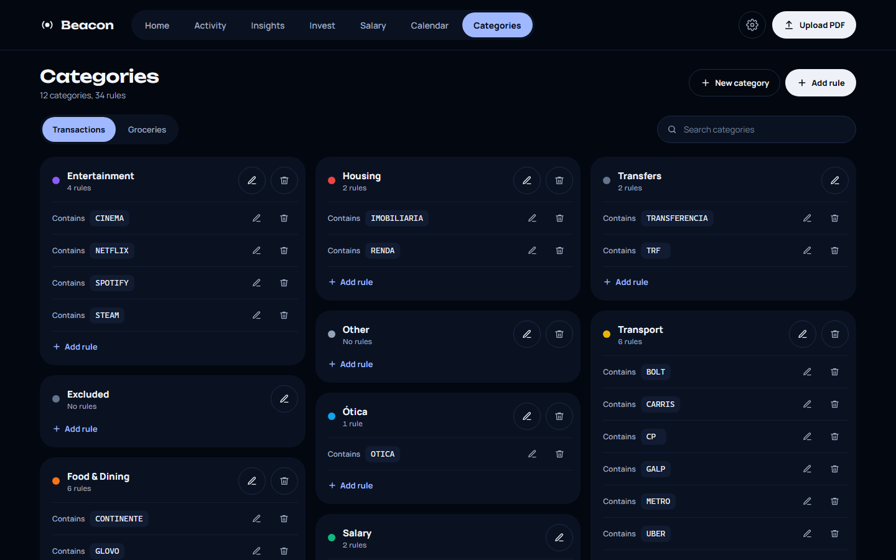
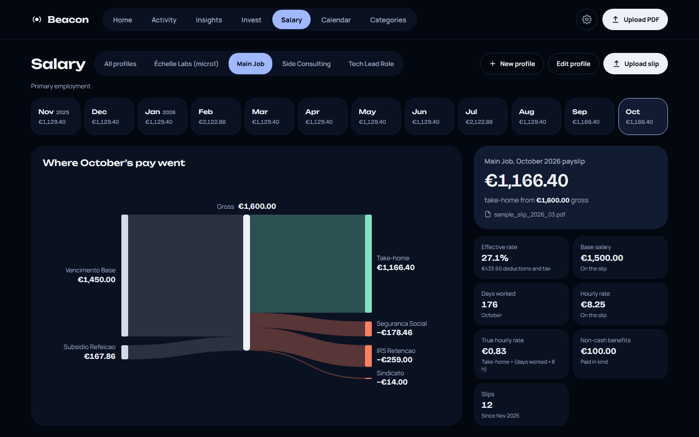
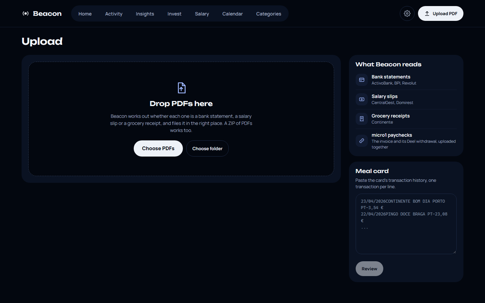
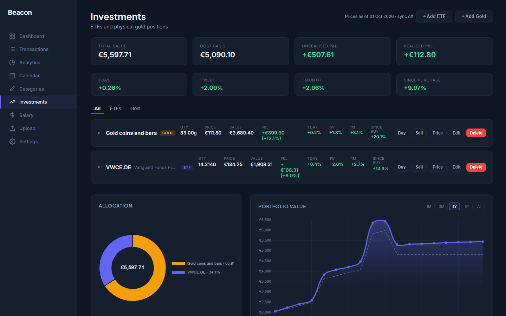
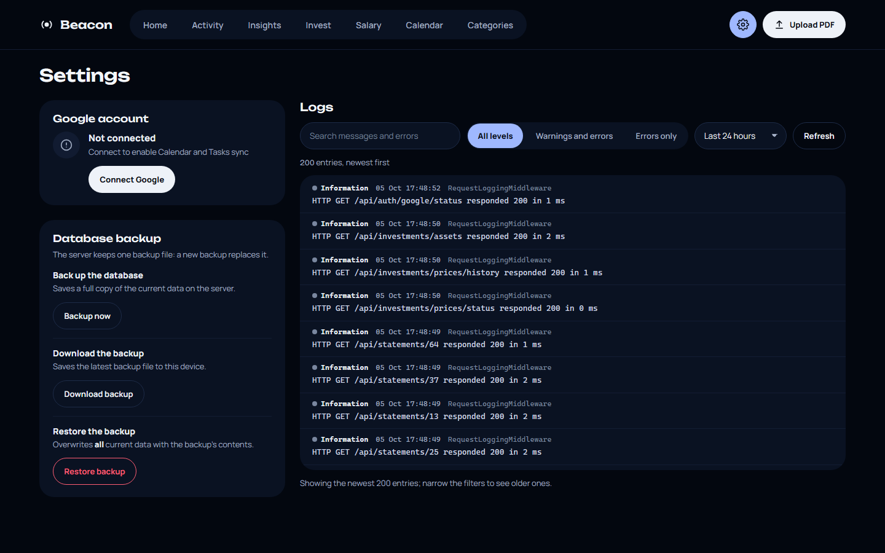

# Beacon

A self-hosted personal finance dashboard. Upload bank statement PDFs and salary slips, and the app extracts transactions, categorises them automatically, and gives you analytics over time. Built to run on a home server and accessed remotely.

---

## Screenshots

### Home



### Activity



### Insights



### Categories



### Salary



### Upload



### Invest



### Settings



---

## What it does

Bank statement PDFs are uploaded through the web interface. A Python script (pdfplumber) extracts the raw text per page, and a bank-specific parser turns that into structured transaction records. Trade Republic is uploaded as its monthly CSV export instead, read as text without pdfplumber; its buys are left out of spending and added to the Invest page as holdings, fees included. From there you can set categories on transactions manually or create rules that apply categories automatically based on description patterns. Transactions and grocery items in the protected Excluded category (transfers between your own accounts, for example) are left out of every total and chart. The Insights page aggregates spending by category and month.

Salary slip PDFs go through a similar flow - upload, parse, review the extracted numbers, then save. Salary profiles let you track multiple jobs or income sources separately. A micro1 paycheck arrives as two PDFs, a USD invoice and a Deel withdrawal confirmation: the bulk upload pairs them by amount and saves one EUR slip at Deel's real exchange rate, with the exchange fee as a deduction. A job that pays twice a month, or pays holiday and Christmas pay on a slip of their own, can add that second pay run to the month's slip instead of creating a second one.

Grocery receipts from Continente can be uploaded as PDFs. Items are extracted, mapped to spending categories, and displayed in a filterable item list with monthly totals.

Meal-card statements (which have no PDF export) are imported by pasting the transaction history as text.

The Investments page tracks ETF and physical gold positions: buy/sell lots with fees, average-cost P&L (realised and unrealised), price change over 1 day/1 week/1 month/since purchase, an allocation chart and portfolio value history. Beacon keeps its own daily price history: the first sync of an asset stores 15 years of daily closes, then one sync a day after the European close adds the latest one. Closes come from Yahoo Finance and an ETF known only by its ISIN gets its ticker from OpenFIGI, both without a key or a daily quota, so the server needs outbound HTTPS to `query1.finance.yahoo.com` and `api.openfigi.com`. Prices entered by hand are never overwritten, and stale prices are flagged on the page and in `/api/health`. Gold is tracked in grams; ETFs are assumed EUR-listed.

Beyond finance, the app integrates with Google Calendar and Google Tasks (optional): the Calendar page shows your events and tasks, supports creating/editing both, and works fully offline from Google with a graceful empty state. The Settings page manages the Google connection and database backup/restore, including downloading the backup file.

Everything is stored in one SQLite file and served over a REST API. The Angular frontend talks to the API through a proxy in development, and through Nginx in production.

---

## Supported formats

| Type | Format | Detection |
| --- | --- | --- |
| Bank statement (PDF) | ActivoBank | BIC `ACTVPTPL` or "EXTRATO COMBINADO" |
| Bank statement (PDF) | BPI | SWIFT `BBPIPTPL` or "EXTRACTO INTEGRADO" |
| Bank statement (PDF) | Revolut (EUR accounts) | BIC `REVOPTP2` or "Revolut Bank UAB" |
| Bank statement (CSV) | Trade Republic transaction export, one calendar month per file | The export's header line |
| Salary slip (PDF) | CentralGest payroll | "CentralGest Software" footer |
| Salary slip (PDF) | Domirest payroll | "DOMIREST" header |
| Salary slip (2 PDFs) | micro1 invoice (USD) + Deel withdrawal confirmation | "Micro1 Inc." and "Deel transaction ID"; paired by USD amount |
| Grocery receipt (PDF) | Continente | "Modelo Continente" |
| Meal card | Pasted text (one transaction per line) | - |

Bank statements must be EUR - non-EUR statements are rejected at upload (salary slips and grocery receipts are not currency-checked; a micro1 invoice is converted to EUR through its Deel withdrawal). A Trade Republic export has no balances, so each month opens at the previous month's closing (0.00 for the first, with a warning) and a missing month in between is refused; a row of a kind not seen in a real export yet (a sell, a dividend) is refused rather than guessed. Scanned (image-only) PDFs are rejected with a clear message. Files that match none of the formats are reported per file without failing the batch. A micro1 invoice or Deel confirmation without its pair is flagged and never imported.

---

## Tech stack

| Layer          | Technology                                  |
| -------------- | ------------------------------------------- |
| PDF extraction | Python 3 + pdfplumber                       |
| API            | ASP.NET Core 10 (.NET 10)                   |
| Database       | SQLite + EF Core 10 (code-first migrations) |
| Frontend       | Angular 22 (standalone components, signals) |
| Charts         | Chart.js 4                                  |
| Tests          | xUnit (backend), Vitest (frontend)          |

---

## Architecture

The backend follows a feature-driven CQRS pattern without MediatR - each use case is a plain class injected via DI. There's no handler registry or reflection magic; everything is registered explicitly in `Program.cs`. Features live under `api/Beacon.Api/Features/`, each with `Commands/` and `Queries/` subdirectories.

```
Features/
  Transactions/
    Commands/SetTransactionCategory/
      SetTransactionCategoryCommand.cs
      SetTransactionCategoryCommandHandler.cs
      SetTransactionCategoryResponse.cs
    Queries/GetTransactions/
  Categories/
  Salary/
  Statements/
```

PDF parsers use a strategy pattern. Every parser implements `IBankStatementParser`, `ISalarySlipParser` or `IGroceryReceiptParser`, and a factory picks the right one at runtime by calling `CanParse()` against the extracted text. Adding a new bank means adding one file and one DI registration - nothing else changes. Meal-card text goes through the static `MealCardTextParser`, and every parsed document passes a `ParseVerifier` reconciliation (opening + credits − debits vs closing, line items vs totals) that surfaces warnings in the UI.

The frontend uses Angular signals for state. `FinanceService` is the single source of truth and exposes computed signals that derived components consume directly. There are no NgModules; everything is standalone components with lazy-loaded routes.

---

## Project structure

```
beacon/
├── api/
│   ├── Beacon.Api/
│   │   ├── Controllers/
│   │   ├── Data/              # AppDbContext (EF Core)
│   │   ├── Features/          # CQRS handlers per feature
│   │   ├── Migrations/        # EF Core generated
│   │   ├── Models/            # Domain entities
│   │   └── Services/Parsing/  # Bank & salary PDF parsers
│   └── Beacon.Tests/      # xUnit tests
├── web/
│   └── src/app/
│       ├── core/              # Services, interceptors, models, utils
│       └── pages/             # Lazy-loaded routed components
├── scripts/
│   ├── pdfExtractor.py        # Python: PDF → page text (called by .NET)
│   ├── run-backend.ps1        # API with local/environment.dev (applies migrations first)
│   ├── run-frontend.ps1       # Angular dev server, once the API answers
│   └── reset-db.ps1           # Drop + recreate database
├── docs/                      # Architecture, decisions (ADRs), roadmap, screenshots
├── .claude/                   # Claude Code agents, the task skill, shared permissions
├── CLAUDE.md                  # Working rules: invariants, conventions, git workflow
└── beacon.sln
```

---

## Getting started

After cloning, run `scripts/setup.sh` (or `scripts/setup.ps1` on Windows) once: it enables the git hooks in `.githooks/`, which check commit subjects and guard the protected branches.

### Requirements

- .NET 10 SDK. The EF tool (`dotnet-ef`) is pinned in `dotnet-tools.json`: `dotnet tool restore` installs it, and the scripts run that themselves.
- Node.js 22.22.3 or newer 22.x, or 24.15 or newer (Angular 22 requires one of these; via nvm recommended)
- Python 3 + pdfplumber: `pip install -r scripts/requirements.txt`
  (on Debian/Ubuntu with PEP 668 protection, use a venv or `pip install --user --break-system-packages -r scripts/requirements.txt`)

### Configuration

Copy `api/Beacon.Api/appsettings.template.json` to `appsettings.Development.json` and fill in:

- `ApiKey` - **must be `dev-only-key` for local development**: the Angular dev build sends that exact value (`web/src/environments/environment.ts`) in the `X-Api-Key` header, so a different backend key makes every frontend call fail with 401. Note that if you leave `ApiKey` unset entirely, Development mode skips key validation altogether - set it anyway so dev behaves like production (which fails closed). Pick your own secret only for production: the production build carries the placeholder `FINANCE_HUB_API_KEY_PLACEHOLDER` (`web/src/environments/environment.prod.ts`), which the deployment must replace with that key in the built files.
- `ConnectionStrings.DefaultConnection` - `Data Source=<path to the database file>`, for example `Data Source=/home/you/beacon/local/beacon.db`. The file and its folder are created by the first `dotnet ef database update`.
- `Storage.Path` - where uploaded PDFs and CSV exports will be stored
- `Python.Executable` - `python3` on Linux/macOS, `python` on Windows (the stock `python3` alias on Windows opens the Microsoft Store instead of running Python)
- `Python.ExtractorScript` - absolute path to `scripts/pdfExtractor.py`

The committed `api/Beacon.Api/Properties/launchSettings.json` sets `ASPNETCORE_ENVIRONMENT=Development` and port `5098`, so `dotnet run` picks up `appsettings.Development.json` and matches the frontend proxy with no extra flags.

### Create the database (first run only)

```bash
dotnet tool restore
cd api/Beacon.Api
dotnet ef database update
```

### Linux / macOS

```bash
# Terminal 1 - API (http://localhost:5098)
cd api/Beacon.Api
export ApiKey=dev-only-key
dotnet run

# Terminal 2 - Frontend (http://localhost:4200)
cd web
npm install
npx ng serve
```

Swagger UI: `http://localhost:5098/swagger` (no API key needed in development).

### Windows

```powershell
# Terminal 1 - API
cd api\Beacon.Api
$env:ApiKey="dev-only-key"
dotnet run

# Terminal 2 - Frontend
cd web
npm install
npx ng serve
```

Or keep the settings in `local/environment.dev` (git-ignored; the variables from "Environment variables" below, one `KEY=value` per line): `scripts/run-backend.ps1` loads it, applies migrations and starts the API, and `scripts/run-frontend.ps1` starts the client once the API answers. The VS Code task "Beacon: Start All" runs both.

The Angular dev server proxies `/api/*` to `http://localhost:5098` via `web/proxy.conf.json`.

---

## Environment variables

| Variable                               | Description                                                                                   |
| -------------------------------------- | --------------------------------------------------------------------------------------------- |
| `ApiKey`                               | Secret validated via `X-Api-Key` header                                                       |
| `Storage__Path`                        | Directory for uploaded PDFs and CSV exports                                                   |
| `Backup__Path`                         | Directory for database backups                                                                |
| `ConnectionStrings__DefaultConnection` | The SQLite database file: `Data Source=<path>`                                                |
| `Python__Executable`                   | Python binary (`python` or `python3`)                                                         |
| `Python__ExtractorScript`              | Absolute path to `scripts/pdfExtractor.py`                                                    |
| `Prices__Enabled`                      | Sync investment prices (default `true`; set `false` for a demo or offline setup)              |
| `Prices__HistoryYears`                 | Years of daily closes the first sync of an asset stores (default 15)                          |
| `Prices__DailyRunTime`                 | Time of the daily price sync, UTC (default `22:00`)                                           |
| `Prices__GoldProxySymbol`              | EUR-listed gold ETC that prices gold per gram (default `4GLD.DE`)                             |
| `Prices__JumpWarningPercent`           | Day-to-day price move that logs a warning (default 20)                                        |
| `Logs__Path`                           | Folder for the log files (optional; without it, logs go to the console only)                  |
| `Logs__Keep`                           | Days of log files kept (default 14)                                                           |
| `Logging__LogLevel__<Category>`        | Minimum log level for a category (`Default` for the rest); see ARCHITECTURE.md, "Logging"     |
| `GoogleServices__ClientId`             | Google OAuth 2.0 client ID (optional - only needed for Google Calendar/Tasks sync)            |
| `GoogleServices__ClientSecret`         | Google OAuth 2.0 client secret                                                                |
| `GoogleServices__RedirectUri`          | OAuth redirect URI registered in Google Cloud Console (see below)                             |
| `GoogleServices__FrontendUrl`          | Base URL of the Angular frontend, used to redirect after OAuth (e.g. `http://localhost:4200`) |

Google Calendar and Tasks (optional):

- Google accepts a plain-HTTP or IP-address redirect URI only for localhost. Locally, use `http://localhost:5098/api/auth/google/callback`. For remote access, serve Beacon on its Tailscale HTTPS name (`tailscale serve`), use `https://<device>.<tailnet>.ts.net/api/auth/google/callback`, and set `GoogleServices__FrontendUrl` to `https://<device>.<tailnet>.ts.net`.
- Set the OAuth consent screen's publishing status to "In production". In "Testing", Google expires the refresh token after 7 days and Beacon asks you to reconnect. The app stays unverified, so Google shows a warning screen when you connect; that is fine for personal use.

---

## Database

```bash
cd api/Beacon.Api
dotnet ef migrations add <MigrationName>
dotnet ef database update
```

To reset to a clean state: `./scripts/reset-db.ps1` (PowerShell).

The whole database is one file. To back it up, copy it while the API is stopped (with WAL, recent writes may still sit in the `-wal` file beside it while the API runs), or use the backup on the Settings page.

### Moving from SQL Server

Beacon used SQL Server until 30 September 2026. The one-off tool that copied a SQL Server database into SQLite has since been removed; to move an older database, check out a commit that still has `scripts/MigrateToSqlite` (`git log -- scripts/MigrateToSqlite`) and follow the README there.

---

## Tests

```bash
# Backend - xUnit (642 tests)
cd api
dotnet test Beacon.Tests/

# Frontend - Vitest
cd web
npx ng test --watch=false

# Formatting, checked by CI: dotnet format from the repository root, Prettier in web/
dotnet format beacon.sln
cd web && npx prettier --write .

# Known vulnerabilities, checked by CI: any in NuGet packages, high or critical in npm
dotnet list beacon.sln package --vulnerable --include-transitive
cd web && npm audit --audit-level=high
```

CI also lists the NuGet packages of `scripts/SeedRunner`, which is not in `beacon.sln`. Dependabot proposes minor and patch updates every week (`.github/dependabot.yml`).

Every backend test runs on its own SQLite database, in memory unless it needs a database file that is missing or damaged. Backend coverage spans all bank/salary/grocery parsers, the upload pipeline (behind a stubbed PDF extractor, and CSV exports read as text), the Trade Republic export's balance chaining and the import of its buys as lots, file storage and the startup cleanup of orphaned uploads, the API-key, exception and request-logging middleware, the log files and their reader (filters, limits, client errors), the health check, categorisation rules, backup/restore (with a round trip on a real SQLite database), the SQLite behaviour the app relies on (decimal sums and sorts in SQL, searches and sorting with accents, unique names that ignore case, decimals held to their scale), and the CQRS handlers for statements, transactions, categories, salary (including merging a second pay run into a month), groceries, investments (including the daily price sync, its sources, ISIN lookup and failures, a changed ticker, stale prices across exchange holidays, and the price source's parsing and retries on synthetic responses) and Google services, plus the micro1/Deel invoice pairing and USD-to-EUR reconciliation.

---

## Deployment

Beacon runs on a home server and is reached remotely over Tailscale. Nginx serves the Angular build as static files and forwards `/api/*` to Kestrel; the API runs as a systemd service whose environment comes from `local/environment` in the server's checkout (git-ignored; the variables from "Environment variables" above, and no `appsettings.json`).

The server runs a checkout of `main` (ADR-021) and deploys each new commit on it by itself (ADR-027), so merging a release PR puts it in production a few minutes later. The scripts that do it belong to the server's setup, not to this repository. A deploy:

1. Fast-forwards the checkout, refusing local changes.
2. Builds the API (`dotnet publish -c Release` in `api/Beacon.Api`, without symbols) with `scripts/pdfExtractor.py` copied beside it, and the client (`npm ci`, then `npx ng build --configuration=production` in `web/`).
3. Puts `ApiKey` in place of the placeholder in the built client.
4. Keeps the running release, stops the service, applies the migrations, installs the new release and starts it.
5. Waits for `/api/health` to answer. If anything fails once the service is stopped, the previous release goes back. Migrations are never reverted.

What a deploy relies on, so a change to any of it says so in its PR:

- `dotnet publish -c Release` in `api/Beacon.Api` produces a runnable `Beacon.Api.dll`, and `npx ng build --configuration=production --output-path=<folder>` in `web/` puts the site in `<folder>/browser`, which Nginx serves.
- `scripts/pdfExtractor.py` stays at that path; the deploy copies it beside the API, where `Python__ExtractorScript` points.
- `web/src/environments/environment.prod.ts` carries `FINANCE_HUB_API_KEY_PLACEHOLDER`. The deploy fails if the built client lacks it, or still has it after the replacement.
- Migrations apply with `dotnet tool restore && dotnet ef database update` in `api/Beacon.Api`, through the `dotnet-ef` pinned in `dotnet-tools.json`, with the connection string from the environment file.
- `GET /api/health` answers 200 without the API key once the API is up, its database opens and no migration is pending (ADR-026).

To check a running server, `GET /api/health` needs no API key: it answers 200 with `"status": "ok"` and the running `commit` when the API and its database work, and 503 with `"status": "degraded"` and the reason when they don't (`curl -i http://<server>/api/health`).

---

## Security model

A single shared API key (`X-Api-Key` header) protects every endpoint - there are no user accounts. Two routes answer without it: the Google OAuth callback, which Google's redirect calls, and `/api/health`, which reports only whether the API works and which release runs. The key is embedded in the built frontend, so anyone who can load the app can call the API: the intended deployment is a private network (e.g. Tailscale) where reachability *is* the trust boundary. Do not expose the app directly to the internet.

---

## Documentation

- [`docs/ARCHITECTURE.md`](docs/ARCHITECTURE.md) - how Beacon is built and where each kind of logic lives.
- [`docs/DECISIONS.md`](docs/DECISIONS.md) - settled design decisions and why they were made.
- [`docs/ROADMAP.md`](docs/ROADMAP.md) - what is planned.
- [`CLAUDE.md`](CLAUDE.md) - the working rules (invariants, conventions, git workflow, commands). Written for Claude Code; useful for anyone contributing.

---

## License

MIT - see [LICENSE](LICENSE).
